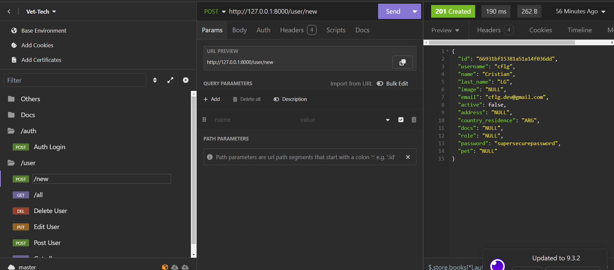

# Guía para Iniciar el Proyecto FastAPI 🚀

## Requisitos Previos

- [Python](https://www.python.org/) 🐍
- [pip](https://pip.pypa.io/en/stable/) 📦

## Pasos para Configurar y Ejecutar el Proyecto

### 1. Crear un Entorno Virtual

Para evitar instalar las dependencias de forma global, es necesario crear un entorno virtual. Navega a la ruta `/backend` en la consola y ejecuta el siguiente comando:

```bash
python -m venv venv
```

### 2. Activar el Entorno Virtual

Para activar el entorno ejecuta el siguiente comando:

```bash
.\venv\Scripts\activate
```

### 3. Instalar las dependencias

```bash
pip install -r requirements.txt
```

### 4. Levantar el server en modo reload para que el server se reinicie cuando haya un cambio:

```bash
uvicorn main:app --reload
```

### 5. Ir a la documentacion automatica:

FastAPI cuenta con documentación autmática usando swagger y redoc.

Es importante aclarar que la direccion local puede cambiar en tu pc.

### Documentación con swagger:

```
http://127.0.0.1:8000/docs
```

### Documentación con redoc:

```
http://127.0.0.1:8000/redoc
```

### Archivo back_queries.json:

Este archivo tiene la finalidad de centralizar el documento de puebas de Insomnia, Postman, etc.



### Archivo reset_db.py:

Este script tiene la finalidad de poder limpiar las colecciones de la db de forma rapida y controlada.
Se puede correr con el siguiente comando:

```bash
python reset_db.py
```
